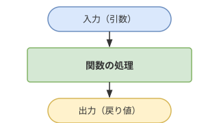

# 2章 引数と戻り値

## 基礎知識

### 関数とは

**関数**とは、処理をひとまとめにして名前をつけたものです。一度定義しておけば、名前を書くだけで何度でも同じ処理を実行できます。

関数は「自動販売機」に例えると理解しやすいです。



- 自動販売機にお金とボタンを押す → 飲み物が出てくる
- 関数に値を渡す（引数）         → 結果が返ってくる（戻り値）

VB.NET では `Function` キーワードで関数を定義します。

```vbnet
Function Greet() As String
    Return "こんにちは！"
End Function

Console.WriteLine(Greet())   ' → こんにちは！
```

`Function 関数名() As 戻り値の型` と書き、`Return` で値を返します。`End Function` で関数の終わりを示します。

---

### 戻り値とは

**戻り値**とは、関数が処理を終えた後に呼び出し元に返す値です。`Return` に続けて返したい値や式を書きます。

```vbnet
Function Add() As Integer
    Return 3 + 5   ' 計算結果の 8 を返す
End Function

Dim result As Integer = Add()   ' result に 8 が入る
Console.WriteLine(result)       ' → 8
```

戻り値がある関数は、式の中でそのまま使えます。

```vbnet
Console.WriteLine(Add() * 2)   ' → 16（8 × 2）
```

戻り値の型は `As 型名` で指定します。`String` を返すなら `As String`、`Integer` を返すなら `As Integer` と書きます。

---

### 関数に値を渡す（引数）

引数なしの関数は毎回同じ結果しか返せません。**引数**を使うと、渡す値によって結果を変えられます。

```vbnet
Function Double(x As Integer) As Integer
    Return x * 2
End Function

Console.WriteLine(Double(5))   ' → 10
Console.WriteLine(Double(3))   ' → 6
```

引数は `関数名(変数名 As 型名)` の形で定義します。関数を呼び出すときは `関数名(値)` と書きます。

引数を変えるだけで同じ関数を何度でも使いまわせます。

---

### 引数を複数定義する

カンマ区切りで複数の引数を定義できます。

```vbnet
Function Sum(x As Integer, y As Integer) As Integer
    Return x + y
End Function

Console.WriteLine(Sum(3, 7))    ' → 10
Console.WriteLine(Sum(10, 20))  ' → 30
```

呼び出す側も同じ順番・個数で値を渡す必要があります。順番が違うと意図しない結果になるので注意しましょう。

---

### 引数の型

引数にも変数と同様に型を指定します。型が合わない値を渡すとエラーになります。

| 型 | 渡せる値の例 |
|---|---|
| `Integer` | `10`, `-5`, `0` |
| `Double` | `3.14`, `0.5` |
| `String` | `"hello"`, `"VB.NET"` |

---

### 複数の値を返す（文字列補間）

VB.NET の関数は値を 1 つしか返せません。複数の計算結果をまとめて返したいときは、カンマ区切りの文字列にまとめる方法が便利です。

```vbnet
Function Powers(x As Integer) As String
    Return $"{x ^ 1},{x ^ 2},{x ^ 3}"
End Function

Console.WriteLine(Powers(2))   ' → 2,4,8
Console.WriteLine(Powers(3))   ' → 3,9,27
```

`$"..."` は文字列補間で、`{式}` の部分が計算結果に置き換わります（1章で学習済み）。

---

## 練習問題

### 問題 2-1

`String` 型の引数 `s` を受け取り、`s` をそのまま返す関数を実装しなさい。

---

### 問題 2-2

`Integer` 型の引数 `x` を受け取り、`x` をそのまま返す関数を実装しなさい。

---

### 問題 2-3

`Integer` 型の引数 `x` を受け取り、`x` を **2 倍・3 倍・4 倍** した結果をカンマ区切りの文字列で返す関数を実装しなさい。

例: `x = 3` のとき `"6,9,12"` を返す

---

### 問題 2-4

`Integer` 型の引数 `x` を受け取り、`x` の **1 乗・2 乗・3 乗** をカンマ区切りの文字列で返す関数を実装しなさい。

例: `x = 2` のとき `"2,4,8"` を返す

**ヒント:** 累乗は `^` 演算子を使います（例: `x ^ 2`）。

---

### 問題 2-5

`Integer` 型の引数 `x`、`y` を受け取り、以下の計算結果をそれぞれ返す関数を実装しなさい。

| 関数名 | 内容 | 戻り値の型 |
|---|---|---|
| `Problem2_5_Sum` | x と y の和 | `Integer` |
| `Problem2_5_Difference` | x と y の差（x − y） | `Integer` |
| `Problem2_5_Product` | x と y の積 | `Integer` |
| `Problem2_5_Division` | x ÷ y の結果（小数あり） | `Double` |
| `Problem2_5_Quotient` | x ÷ y の商（整数） | `Integer` |
| `Problem2_5_Remainder` | x ÷ y の余り | `Integer` |

**ヒント:** 小数ありの除算は `/`、整数の商は `\`、余りは `Mod` を使います。

---

### 問題 2-6

`Integer` 型の引数 `a`、`b` を受け取り、2 つの整数の平均値（整数）を返す関数を実装しなさい。

※ 小数点以下は切り捨ててよい。

**ヒント:** 整数除算 `\` を使うと小数を切り捨てられます。

---

### 問題 2-7

`Integer` 型の引数 `age`（年齢）を受け取り、生まれてからのおおよその日数を返す関数を実装しなさい。

※ 閏年は考慮せず、`年齢 × 365` で計算する。

---

### 問題 2-8

2 つの `Integer` 型引数 `x`、`y`（`x` > `y`）を受け取り、`x ÷ y` の **商と余り** をカンマ区切りの文字列で返す関数を実装しなさい。

例: `x = 10, y = 3` のとき `"3,1"` を返す（商 3、余り 1）

**ヒント:** 整数除算 `\` が商、`Mod` が余りです。
