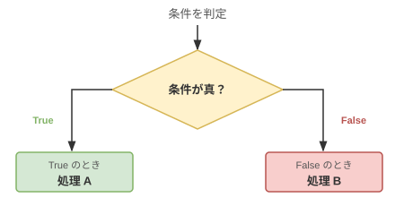

# 3章 分岐

## 基礎知識

### 分岐とは

プログラムは通常、上から順番に実行されます。しかし「点数が 60 点以上なら合格、そうでなければ不合格」のように、**条件によって実行する処理を変えたい**場面があります。これを**分岐**といいます。



分岐を使うことで、状況に応じた柔軟なプログラムが書けるようになります。

---

### Boolean 型と条件式

**Boolean 型**は `True`（真）か `False`（偽）の 2 値だけを持つ型です。`If` 文の条件部分には Boolean の値が入ります。

```vbnet
Dim isPass As Boolean = True
Dim isFail As Boolean = False
```

**条件式**（比較演算子を使った式）を評価すると Boolean 値になります。

```vbnet
Dim x As Integer = 10
Console.WriteLine(x > 5)    ' → True
Console.WriteLine(x > 20)   ' → False
Console.WriteLine(x = 10)   ' → True
```

Boolean 型の変数に条件式の結果を入れておき、後で使うこともできます。

```vbnet
Dim isPositive As Boolean = (x > 0)
If isPositive Then
    Console.WriteLine("正の数です")
End If
```

---

### If 文

条件によって処理を分岐するには `If` 文を使います。`Then` の後に書いた処理は条件が `True` のときだけ実行されます。

```vbnet
If x > 0 Then
    Console.WriteLine("正の数です")
End If
```

`Else` を加えると、条件が `False` のときの処理も書けます。

```vbnet
If x >= 60 Then
    Console.WriteLine("合格")
Else
    Console.WriteLine("不合格")
End If
```

実行する処理が 1 つだけなら、`Then` の後に続けて 1 行で書くこともできます（`End If` は不要）。

```vbnet
If x > 0 Then Console.WriteLine("正の数です")
```

ループの制御（`Exit For` や `Continue For`）と組み合わせるときによく使われる書き方です。

`ElseIf` で 3 つ以上の分岐も表現できます。条件は上から順に評価され、最初に `True` になったブロックだけが実行されます。

```vbnet
If score >= 80 Then
    Console.WriteLine("優")
ElseIf score >= 70 Then
    Console.WriteLine("良")
ElseIf score >= 60 Then
    Console.WriteLine("可")
Else
    Console.WriteLine("不可")
End If
```

> **ポイント:** `ElseIf score >= 70` が評価されるのは、すでに `score >= 80` が `False` だとわかっている場合だけです。そのため「70 以上 80 未満」という条件をわざわざ書かなくても正しく動きます。

---

### 比較演算子

条件式で使う演算子です。結果は必ず `Boolean`（`True` か `False`）になります。

| 演算子 | 意味 | 例 | 結果（x=10 のとき） |
|---|---|---|---|
| `>` | より大きい | `x > 5` | `True` |
| `<` | より小さい | `x < 5` | `False` |
| `>=` | 以上 | `x >= 10` | `True` |
| `<=` | 以下 | `x <= 9` | `False` |
| `=` | 等しい | `x = 10` | `True` |
| `<>` | 等しくない | `x <> 10` | `False` |

> **注意:** 変数への代入も `=` を使いますが、`If` や式の中では比較として扱われます。VB.NET は文脈で自動的に判断します。

---

### 論理演算子

複数の条件を組み合わせるには論理演算子を使います。

| 演算子 | 意味 | 真になる条件 |
|---|---|---|
| `And` | かつ | 左辺も右辺も `True` |
| `Or` | または | 左辺か右辺のどちらかが `True` |
| `Not` | ではない | 元の値が `False` |

```vbnet
Dim x As Integer = 5
Console.WriteLine(x > 0 And x < 10)   ' → True（0より大きく10より小さい）
Console.WriteLine(x < 0 Or x > 3)     ' → True（どちらかが成立）
Console.WriteLine(Not (x = 5))        ' → False（x=5 を反転）
```

#### 短絡評価（AndAlso / OrElse）

`AndAlso` と `OrElse` は、左辺だけで結果が確定した場合に右辺を評価しません（**短絡評価**）。

```vbnet
' x が 0 のとき、y / x はゼロ除算エラーになる
If x <> 0 AndAlso y / x > 1 Then   ' x=0 なら右辺を評価しない → エラー回避
    Console.WriteLine("OK")
End If
```

| 演算子 | 意味 | 短絡評価 |
|---|---|---|
| `AndAlso` | `And` と同じ | 左辺が `False` なら右辺を評価しない |
| `OrElse` | `Or` と同じ | 左辺が `True` なら右辺を評価しない |

エラーを防ぐ目的で使う場面が多いです。通常は `AndAlso` / `OrElse` を使う習慣をつけておくとよいでしょう。

---

### Select Case 文

`If / ElseIf` の代わりに、1 つの変数の値に応じて分岐するときは `Select Case` が読みやすくなります。

```vbnet
Select Case month
    Case 1, 3, 5, 7, 8, 10, 12
        Console.WriteLine("大の月")
    Case 2, 4, 6, 9, 11
        Console.WriteLine("小の月")
    Case Else
        Console.WriteLine("そんな月はありません")
End Select
```

`Case 値1, 値2` のようにカンマで複数の値をまとめて書けます。どの `Case` にも当てはまらない場合は `Case Else` が実行されます。

`If` 文との使い分けの目安：
- 同じ変数を `= 値` で比べるだけなら → `Select Case`
- 範囲比較（`>=`、`<` など）や複数の変数を使う条件 → `If`

---

### 偶数・奇数の判定

`Mod` 演算子（余り）を使います。2 で割った余りが 0 なら偶数、それ以外なら奇数です。

```vbnet
If x Mod 2 = 0 Then
    Console.WriteLine("偶数")
Else
    Console.WriteLine("奇数")
End If
```

負の数も同様に判定できます（例: `-4 Mod 2 = 0` → 偶数）。

---

## 練習問題

### 問題 3-1

`Integer` 型の引数 `x`、`y` を受け取り、`x` が `y` より大きい場合のみ `"xはyより大きい。"` を返す関数を実装しなさい。それ以外の場合は空文字 `""` を返すこと。

---

### 問題 3-2

`Integer` 型の引数 `x`、`y` を受け取り、以下の文字列を返す関数を実装しなさい。

- x > y のとき: `"xはyより大きい"`
- x < y のとき: `"xはyより小さい"`
- x = y のとき: `""` （空文字）

---

### 問題 3-3

`Integer` 型の引数 `x`、`y` を受け取り、大きい方の値を返す関数を実装しなさい。

---

### 問題 3-4

`Integer` 型の引数 `x`、`y` を受け取り、以下の文字列を返す関数を実装しなさい。

- x > y のとき: `"xはyより大きい"`
- x < y のとき: `"xはyより小さい"`
- x = y のとき: `"xとyは等しい"`

---

### 問題 3-5

`Integer` 型の引数 `x` を受け取り、偶数なら `"偶数"`、奇数なら `"奇数"` を返す関数を実装しなさい。

**ヒント:** `x Mod 2 = 0` なら偶数です。

---

### 問題 3-6

`Integer` 型の引数 `x` を受け取り、以下の 4 種類のいずれかを返す関数を実装しなさい。

- `"正の偶数"` / `"正の奇数"` / `"負の偶数"` / `"負の奇数"`

※ `0` は `"正の偶数"` とする。  
※ 負の数も `2` で割り切れれば偶数とする。

---

### 問題 3-7

試験の点数（`Integer` 型引数 `score`）を受け取り、成績を返す関数を 3 種類実装しなさい。

**ケース 1 (`Problem3_7_Case1`)**

| 点数 | 成績 |
|---|---|
| 60 点以上 | `"合格"` |
| 60 点未満 | `"不合格"` |

**ケース 2 (`Problem3_7_Case2`)**

| 点数 | 成績 |
|---|---|
| 80 点以上 | `"たいへんよくできました。"` |
| 60 点以上 80 点未満 | `"よくできました。"` |
| 60 点未満 | `"ざんねんでした。"` |

**ケース 3 (`Problem3_7_Case3`)**

| 点数 | 成績 |
|---|---|
| 80 点以上 | `"優"` |
| 70 点以上 80 点未満 | `"良"` |
| 60 点以上 70 点未満 | `"可"` |
| 60 点未満 | `"不可"` |

---

### 問題 3-8

中間試験の点数 `midterm` と期末試験の点数 `final`（ともに `Integer`）を受け取り、以下の条件で `"合格"` か `"不合格"` を返す関数を実装しなさい。

1. 両方とも 60 点以上 → 合格
2. 合計が 130 点以上 → 合格
3. 合計が 100 点以上で、どちらかが 90 点以上 → 合格
4. 上記以外 → 不合格

**ヒント:** 条件 1〜3 のどれか 1 つでも当てはまれば合格です。

---

### 問題 3-9

曜日 `dayOfWeek`（0=日〜6=土）と時間帯 `timeOfDay`（0=午前、1=午後、2=夜間）を受け取り、病院が開いているか判定する関数を実装しなさい。開いていれば `"○"`、休診なら `"休診"` を返すこと。

|  | 日(0) | 月(1) | 火(2) | 水(3) | 木(4) | 金(5) | 土(6) |
|---|---|---|---|---|---|---|---|
| 午前(0) | 休診 | ○ | 休診 | ○ | ○ | 休診 | ○ |
| 午後(1) | 休診 | ○ | ○ | ○ | ○ | ○ | 休診 |
| 夜間(2) | 休診 | ○ | ○ | 休診 | ○ | ○ | 休診 |

---

### 問題 3-10

`Integer` 型の引数 `x`、`y` を受け取り、以下の各条件が成立するかを `Boolean` で返す関数を 5 つ実装しなさい。

| 関数名 | 条件 |
|---|---|
| `Problem3_10_Cond1` | x は y より小さく、かつ、x と y は共に偶数 |
| `Problem3_10_Cond2` | x と y は等しく、かつ、負の数 |
| `Problem3_10_Cond3` | x は y より小さい、または、x は偶数 |
| `Problem3_10_Cond4` | x は 10 以下または 100 以上で、かつ、y は 10 以上かつ 100 以下 |
| `Problem3_10_Cond5` | 「x も y も負の数」ではない（否定） |

---

### 問題 3-11

`Integer` 型の引数 `choice`（1〜5）を受け取り、選んだ寿司に対応する占いメッセージを返す関数を実装しなさい。`Select Case` 文を使うこと。

| choice | 寿司 | メッセージ |
|---|---|---|
| 1 | まぐろ | `"大吉！今日は積極的に行動しよう。"` |
| 2 | えび | `"中吉。慎重に進めば良い結果が待っている。"` |
| 3 | こはだ | `"吉。こつこつ続けることで道が開ける。"` |
| 4 | いくら | `"小吉。意外なところからチャンスがやってくる。"` |
| 5 | たまご | `"末吉。今日はゆったり過ごすと吉。"` |
| その他 | — | `"選択肢は 1〜5 の数字で入力してください。"` |

---

### 問題 3-12

月を表す `Integer` 型引数 `month` を受け取り、大の月・小の月を判定する関数を実装しなさい。`Select Case` 文を使うこと。

- 大の月（31 日）: 1, 3, 5, 7, 8, 10, 12 → `"{month}月は大の月です"`
- 小の月（30 日以下）: 2, 4, 6, 9, 11 → `"{month}月は小の月です"`
- 1〜12 以外 → `"そんな月はありません"`
