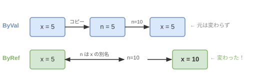

# 6章 メソッド

## 基礎知識

### メソッドとは

2 章では `Function`（値を返す関数）を学びました。この章では、**メソッド**という概念をより深く掘り下げます。

**メソッド**とは、処理のまとまりに名前をつけて再利用できるようにしたものです（`Function` も `Sub` も、どちらもメソッドの一種です）。

なぜメソッドに分けるのかというと、大きく 2 つの理由があります。

**① 同じ処理を何度も書かなくて済む（再利用）**

```vbnet
' メソッドなし → 同じ計算を何度も書く
Dim a1 = 3 * 3
Dim a2 = 5 * 5
Dim a3 = 7 * 7

' メソッドあり → 一か所で定義して何度でも呼び出す
Function Square(n As Integer) As Integer
    Return n * n
End Function

Dim a1 = Square(3)
Dim a2 = Square(5)
Dim a3 = Square(7)
```

**② 処理を名前で表現することでコードが読みやすくなる（可読性）**

```vbnet
' 何をしているかわかりにくい
If n Mod 2 = 0 AndAlso n > 0 Then ...

' 何をしているか名前から明らかにわかる
If IsEven(n) AndAlso IsPositive(n) Then ...
```

---

### Sub と Function

VB.NET のメソッドには **戻り値なし** の `Sub` と **戻り値あり** の `Function` があります。

```vbnet
' Sub: 処理を実行するだけで値を返さない
Sub PrintHello()
    Console.WriteLine("Hello")
End Sub

' Function: 処理して値を返す
Function Double(n As Integer) As Integer
    Return n * 2
End Function
```

呼び出し方の違いも覚えておきましょう。

```vbnet
PrintHello()              ' Sub は単独で呼び出す
Dim x = Double(5)         ' Function は戻り値を受け取る
Console.WriteLine(Double(3))  ' 式の中に直接書くこともできる
```

---

### 引数（パラメーター）

メソッドに渡す値を**引数**といいます。型を明示して宣言します。

```vbnet
Function Add(a As Integer, b As Integer) As Integer
    Return a + b
End Function

Dim result = Add(3, 5)   ' result = 8
```

呼び出し側の変数名とメソッド側のパラメーター名は**別物**です。同じ名前でも異なる名前でも構いません。

```vbnet
Dim x = 3
Dim y = 5
Dim result = Add(x, y)   ' x → a、y → b にコピーされる
```

---

### スコープ（変数の有効範囲）

メソッドの中で宣言した変数は、そのメソッドの中でしか使えません。これを**スコープ**（有効範囲）といいます。

```vbnet
Function CalcTax(price As Integer) As Integer
    Dim taxRate As Double = 0.1   ' この変数は CalcTax の中だけで有効
    Return CInt(price * taxRate)
End Function

' taxRate はここでは使えない（別のメソッドからはアクセスできない）
```

メソッドの引数も同様に、そのメソッドの中だけで使えます。これにより、メソッドどうしが互いの変数に干渉しません。

---

### 戻り値と Return

`Return` で値を返します。`Return` を実行した時点でメソッドが**即座に終了**します。複数の `Return` を書くこともできます。

```vbnet
Function Max(a As Integer, b As Integer) As Integer
    If a >= b Then
        Return a   ' ここで Return するとこの行以降は実行されない
    End If
    Return b       ' a < b のときだけここに到達する
End Function
```

`Return` が複数あっても、実行されるのは必ず 1 つだけです。条件分岐と組み合わせて、場合によって異なる値を返すパターンはよく使います。

---

### ByVal と ByRef

VB.NET の引数渡しには **ByVal**（値渡し）と **ByRef**（参照渡し）の 2 種類があります。

**ByVal（値渡し）** — 変数の「コピー」を渡す。メソッド内で変更しても呼び出し元は変わらない。省略するとデフォルトで ByVal になります。

```vbnet
Sub DoubleByVal(ByVal n As Integer)
    n = n * 2   ' コピーを変更しているだけ
End Sub

Dim x = 5
DoubleByVal(x)
Console.WriteLine(x)   ' → 5（変わらない）
```

**ByRef（参照渡し）** — 変数そのものへの「参照」を渡す。メソッド内での変更が呼び出し元に反映される。

```vbnet
Sub DoubleByRef(ByRef n As Integer)
    n = n * 2   ' 呼び出し元の変数を直接変更する
End Sub

Dim x = 5
DoubleByRef(x)
Console.WriteLine(x)   ' → 10（変わった）
```

イメージ：



`ByRef` は **2 つの変数を交換（スワップ）** するときに特に役立ちます。`Function` では 1 つの値しか返せませんが、`ByRef` を使えば複数の変数を同時に書き換えられます。

---

### Boolean を返す関数

条件を判定して `True` / `False` を返す関数は、`If` 文の条件部分に直接使えます。複雑な条件に名前をつけることでコードが読みやすくなります。

```vbnet
Function IsEven(n As Integer) As Boolean
    Return n Mod 2 = 0
End Function

If IsEven(42) Then
    Console.WriteLine("偶数")
End If

' 組み合わせも簡単
If IsEven(x) AndAlso IsEven(y) Then
    Console.WriteLine("両方偶数")
End If
```

慣習として、`Boolean` を返す関数名は `Is〜`（〜か？）や `Has〜`（〜を持つか？）のように疑問文に対応した形にすると意図が伝わりやすいです。

---

### Char 型

`Char` は **1 文字**を表す型です。`String`（文字列）と異なり、必ず 1 文字だけを格納します。

```vbnet
Dim c As Char = "A"c   ' 文字リテラルは末尾に c を付ける
Dim s As String = "A"  ' こちらは文字列（1文字の String）
```

`Char` を引数として受け取ると、呼び出し側が任意の文字を指定できます。

```vbnet
Function Repeat(ch As Char, n As Integer) As String
    Return New String(ch, n)   ' ch を n 個並べた文字列を作る
End Function

Console.WriteLine(Repeat("*"c, 5))   ' → *****
Console.WriteLine(Repeat("-"c, 3))   ' → ---
```

---

## 練習問題

### 問題 6-1

整数 `n` を受け取り、**2 乗**（`n × n`）を返す関数を実装しなさい。

**解答例:** `Square` という名前で関数を定義し、`Problem6_1` から呼び出します。

```vbnet
Private Shared Function Square(n As Integer) As Integer
    Return n * n
End Function

Public Shared Function Problem6_1(n As Integer) As Integer
    Return Square(n)
End Function
```

---

### 問題 6-2

2 つの整数 `a`、`b` を受け取り、**平均**（整数除算）を返す関数を実装しなさい。

**ヒント:** VB.NET の整数除算は `\` 演算子です（`/` は浮動小数点になります）。

**解答例:** `Average` という名前で関数を定義し、`Problem6_2` から呼び出します。

---

### 問題 6-3

2 つの整数 `a`、`b` を受け取り、**大きい方**を返す関数を実装しなさい。

**解答例:** `Max` という名前で関数を定義し、`Problem6_3` から呼び出します。

---

### 問題 6-4

サイズ `size` を受け取り、`$` で作った **直角三角形** を文字列で返す関数を実装しなさい。

- 1 行目: `$`
- 2 行目: `$$`
- n 行目: `$` × n

各行を改行（`Environment.NewLine`）で結合して返します。

例: `size=3` → `"$" & vbNewLine & "$$" & vbNewLine & "$$$"`

**ヒント:** `List(Of String)` に各行を追加し、`String.Join(Environment.NewLine, lines)` でまとめると簡潔に書けます。

**解答例:** `Triangle` という名前で関数を定義し、`Problem6_4` から呼び出します。

---

### 問題 6-5

問題 6-4 で実装した `Triangle` を**改造**して、`$` の代わりに任意の文字 `ch`（`Char` 型）を受け取れるようにしなさい。あわせて、`Problem6_4` も改造後の `Triangle(size, "$"c)` を呼び出すように書き直しなさい。

**ヒント:** `New String(ch, n)` で `ch` を `n` 個並べた文字列が作れます。`String.Join(Environment.NewLine, lines)` で行リストを改行でつなげられます。

**解答例:** `Triangle(size As Integer, ch As Char)` にシグネチャを変更し、`Problem6_4` と `Problem6_5` の両方からこの関数を呼び出します。

---

### 問題 6-6

1〜9 の整数 `n` を受け取り、**九九の `n` の段** を文字列で返す関数を実装しなさい。

- 各行の形式: `"n×1=積"`, `"n×2=積"`, ..., `"n×9=積"`
- 各行を `Environment.NewLine` で結合して返す

例: `n=3` の 1 行目 → `"3×1=3"`

**解答例:** `KukuRow` という名前で関数を定義し、`Problem6_6` から呼び出します。

---

### 問題 6-7

整数 `n` を受け取り、`n` が **素数かどうか** を `Boolean` で返す関数を実装しなさい。

- 素数: 1 とそれ自身以外に約数を持たない 2 以上の整数
- 1 は素数ではない

**ヒント:** 2 から `√n` までの数で割り切れるか調べれば十分です。`Math.Sqrt(n)` で平方根が求まります。

**解答例:** `IsPrime` という名前で関数を定義し、`Problem6_7` から呼び出します。

---

### 問題 6-8

2 つの `Integer` 変数 `a`、`b` を **ByRef** で受け取り、値を **交換（スワップ）** する Sub を実装しなさい。

呼び出し後に `a` と `b` の値が入れ替わっていることを確認します。

**解答例:** `Swap` という名前で Sub を定義し、`Problem6_8` から呼び出します。

---

### 問題 6-9

`Integer` 型配列 `numbers` を受け取り、配列を **昇順に並べ替える（元の配列を直接変更する）** Sub を実装しなさい。

問題 5-8 は新しい配列を返しましたが、この問題は **元の配列を直接書き換えます**。

**解答例:** 問題 6-8 で実装した `Swap` ヘルパーを利用して選択ソートを実装します。
