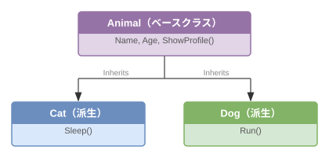

# 8章 クラスⅡ

## 基礎知識

### 継承とは

7 章では 1 つのクラスを設計しました。しかし複数のクラスが共通のデータや操作を持つことはよくあります。

たとえば `Cat` クラスと `Dog` クラスを別々に作ると、`Name`・`Age` プロパティや `ShowProfile()` メソッドを両方に書かなければなりません。

```vbnet
' 同じコードを二か所に書くのは非効率
Public Class Cat
    Public Property Name As String
    Public Property Age As Integer
    Public Function ShowProfile() As String ...
    Public Function Sleep() As String ...   ' Cat 固有
End Class

Public Class Dog
    Public Property Name As String   ' Cat と全く同じ
    Public Property Age As Integer   ' Cat と全く同じ
    Public Function ShowProfile() As String ...  ' Cat と全く同じ
    Public Function Run() As String ...   ' Dog 固有
End Class
```

**継承**を使うと、共通部分を**ベースクラス（親クラス）**に一か所だけ書き、各クラス固有の部分だけを**派生クラス（子クラス）**に追加できます。



この関係を「Cat は Animal の一種（Cat is-a Animal）」と表現します。継承が自然に使えるのは、この「is-a 関係」が成立するときです。

---

### 継承（Inherits）

`Inherits` キーワードでベースクラスを指定します。派生クラスはベースクラスのプロパティ・メソッドをそのまま使えます。

```vbnet
Public Class Animal
    Public Property Name As String = ""
    Public Property Age As Integer = 0
End Class

' Animal を継承した Cat クラス
Public Class Cat
    Inherits Animal

    Public Function Sleep() As String
        Return "スースー"
    End Function
End Class
```

```vbnet
Dim cat As New Cat()
cat.Name = "タマ"              ' Animal のプロパティを Cat でも使える
Console.WriteLine(cat.Name)    ' → "タマ"
Console.WriteLine(cat.Sleep()) ' → "スースー"
```

---

### コンストラクタと MyBase.New

派生クラスのコンストラクタでは、`MyBase.New(...)` でベースクラスのコンストラクタを呼び出します。`MyBase` はベースクラス自身を指すキーワードです。

```vbnet
Public Class Animal
    Public Sub New(name As String, age As Integer)
        Me.Name = name
        Me.Age = age
    End Sub
    Public Property Name As String
    Public Property Age As Integer
End Class

Public Class Cat
    Inherits Animal

    Public Sub New(name As String, age As Integer)
        MyBase.New(name, age)   ' Animal のコンストラクタに処理を委ねる
    End Sub
End Class
```

```vbnet
Dim cat As New Cat("タマ", 2)
Console.WriteLine(cat.Name)   ' → "タマ"（Animal のコンストラクタが設定した）
```

`MyBase.New` を呼ぶ行は、コンストラクタの**先頭に書く**必要があります。

---

### オーバーライド（Overrides / Overridable）

ベースクラスのメソッドを派生クラスで**上書き**することを**オーバーライド**といいます。

- ベースクラス側: 上書きを許可するメソッドに `Overridable` を付ける
- 派生クラス側: 上書きするメソッドに `Overrides` を付ける

```vbnet
Public Class Animal
    Public Overridable Function Speak() As String
        Return "......"    ' デフォルトの実装
    End Function
End Class

Public Class Cat
    Inherits Animal

    Public Overrides Function Speak() As String
        Return "ニャー"    ' Cat 専用の実装で上書き
    End Function
End Class

Public Class Dog
    Inherits Animal

    Public Overrides Function Speak() As String
        Return "ワンワン"    ' Dog 専用の実装で上書き
    End Function
End Class
```

> **オーバーライドとオーバーロードの違い:**
> - **オーバーライド（Overrides）:** 継承関係にある親のメソッドを子で上書きする（同じ名前・同じ引数）
> - **オーバーロード（Overloads）:** 同じクラス内に引数が異なる同名メソッドを複数定義する

---

### ポリモーフィズム（多態性）

**ポリモーフィズム**とは「同じ操作を型によって異なる動作にできる」性質です。

ベースクラス型の変数に派生クラスのインスタンスを代入できます。メソッドを呼び出すと、変数の型（`Animal`）ではなく**実際のインスタンスの型**（`Cat` や `Dog`）に応じたメソッドが実行されます。

```vbnet
Dim animals As Animal() = {
    New Cat("タマ", 2),
    New Dog("ポチ", 3),
    New Cat("ミケ", 1)
}

For Each a In animals
    Console.WriteLine(a.Speak())   ' Cat なら "ニャー"、Dog なら "ワンワン"
Next
```

ポリモーフィズムの強みは、**新しい動物クラスを追加してもループのコードを変えなくてよい**点です。

```vbnet
' Bird クラスを追加しても、上のループはそのまま動く
Public Class Bird
    Inherits Animal
    Public Overrides Function Speak() As String
        Return "チュンチュン"
    End Function
End Class
```

ポリモーフィズムがない場合は、型ごとに `If` で分岐するコードを書かなければならず、種類が増えるたびに修正が必要になります。

---

## 練習問題

> **注意:** 問題 8-1 以降の Animal クラスはすでに実装済みです。骨格ファイルの Animal を変更せず、Cat と Dog を実装してください。
>
> **補足:** この章の `Cat`・`Dog` クラスは 7章の `Dog` クラスとは別の設計です。7章の `Dog` は単独クラスでしたが、8章の `Cat`・`Dog` は `Animal` を継承した派生クラスです。

### 問題 8-1

`Animal` クラスを継承した `Cat` クラスを実装しなさい。

- コンストラクタ `New(name As String, age As Integer)` で `MyBase.New(name, age)` を呼ぶ
- `Sleep()` メソッドを実装し、`"スースー"` を返す

次に、`Problem8_1` で `Cat` をインスタンス化し、`ShowProfile()` と `Sleep()` の結果をカンマ区切りで返しなさい。

**解答例:**

```vbnet
Public Shared Function Problem8_1(name As String, age As Integer) As String
    Dim cat As New Cat(name, age)
    Return cat.ShowProfile() & "," & cat.Sleep()
End Function
```

---

### 問題 8-2

`Animal` クラスを継承した `Dog` クラスを実装しなさい。

- コンストラクタ `New(name As String, age As Integer)` で `MyBase.New(name, age)` を呼ぶ
- `Run()` メソッドを実装し、`"トコトコ"` を返す

次に、`Problem8_2` で `Dog` をインスタンス化し、`ShowProfile()` と `Run()` の結果をカンマ区切りで返しなさい。

**ヒント:** `Problem8_1` と同じパターンで `Dog` を使います。

---

### 問題 8-3

`Cat` クラスに `Speak()` メソッドをオーバーライドして実装しなさい。

- `Animal.Speak()` のデフォルト実装は `"......"` を返す
- `Cat.Speak()` は `"ニャー"` を返す

次に、`Problem8_3` で `Animal` 型の変数に `Cat` を代入して `Speak()` を呼び出しなさい。

**ヒント:** `Dim a As Animal = New Cat("タマ", 2)` のように `Animal` 型変数に代入しても、`Speak()` は `Cat` のものが呼ばれます。

---

### 問題 8-4

`Dog` クラスに `Speak()` メソッドをオーバーライドして実装しなさい。

- `Dog.Speak()` は `"ワンワン"` を返す

次に、`Problem8_4` で `Animal` 型の変数に `Dog` を代入して `Speak()` を呼び出しなさい。

**ヒント:** `Problem8_3` と同じパターンで `Dog` を使います。

---

### 問題 8-5

`Animal` 型の配列を使って、`Cat` と `Dog` のインスタンスをまとめて扱いなさい。

- 要素数 4 の `Animal` 配列を作成する
- 偶数インデックス（0、2）に `Cat`、奇数インデックス（1、3）に `Dog` を格納する
- ループで各要素の `ShowProfile()` と `Speak()` を呼ぶ

次に、`Problem8_5` で上記の配列を作成し、ループで各要素の `Speak()` を呼んでカンマ区切りの文字列で返しなさい。

**ヒント:** `Problem8_5` では 4 要素の `Animal` 配列に `Cat` と `Dog` を交互に格納し、`String.Join(",", ...)` などでまとめて返します。

**ポイント:** `Animal` 型の変数に `Cat`/`Dog` を代入しても、`Speak()` は実際のクラスのものが呼ばれます。これがポリモーフィズムです。
